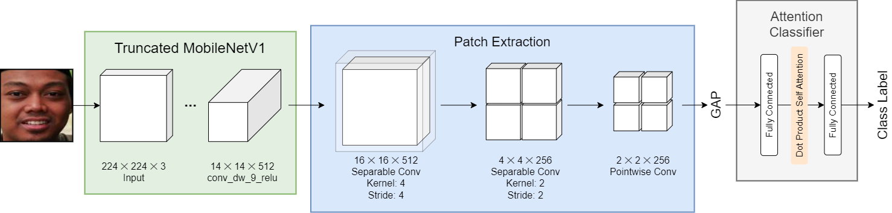

# PAtt-Lite: Lightweight Patch and Attention MobileNet for Challenging Facial Expression Recognition
This is the official implementation for our paper [PAtt-Lite: Lightweight Patch and Attention MobileNet for Challenging Facial Expression Recognition](https://arxiv.org/pdf/2306.09626.pdf). We have submitted our paper for publication and it is under review. The source codes will be updated here once the paper is accepted. 

## Abstract


Facial Expression Recognition (FER) is a machine learning problem that deals with recognizing human facial expressions. While existing work has achieved performance improvements in recent years, FER in the wild and under challenging conditions remains a challenge. In this paper, a lightweight patch and attention network based on MobileNetV1, referred to as PAtt-Lite, is proposed to improve FER performance under challenging conditions. A truncated ImageNet-pre-trained MobileNetV1 is utilized as the backbone feature extractor of the proposed method. In place of the truncated layers is a patch extraction block that is proposed for extracting significant local facial features to enhance the representation from MobileNetV1, especially under challenging conditions. An attention classifier is also proposed to improve the learning of these patched feature maps from the extremely lightweight feature extractor. The experimental results on public benchmark databases proved the effectiveness of the proposed method. PAtt-Lite achieved state-of-the-art results on CK+, RAF-DB, FER2013, FERPlus, and the challenging conditions subsets for RAF-DB and FERPlus. 

## Notebook
The training notebook is uploaded [here](patt-lite-notebook.ipynb). 

## License
PAtt-Lite is available under the MIT license. See [LICENSE](LICENSE) for details. 

## Citation
If you find our work useful in your research, please consider citing our paper. 
```bibtex
@article{ngwe2023patt,
  title={PAtt-Lite: Lightweight Patch and Attention MobileNet for Challenging Facial Expression Recognition},
  author={Ngwe, Jia Le and Lim, Kian Ming and Lee, Chin Poo and Ong, Thian Song},
  journal={arXiv preprint arXiv:2306.09626},
  year={2023}
}
```
